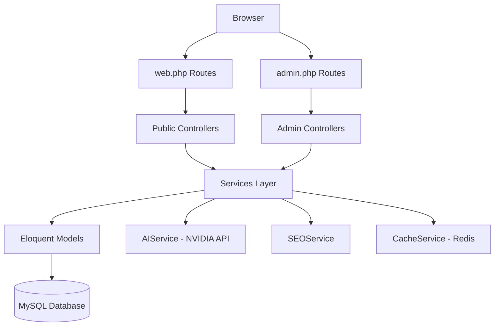

# BlogV1 Architecture

## Stack
- Laravel 12 + Blade + Tailwind CSS v4 + Alpine.js
- MySQL 8+ database
- Redis (optional) for cache/queue/sessions

## Directory Structure

### `app/`
```
app/
├── Console/
│   └── Commands/          # Artisan commands
├── Events/                # Application events
├── Exceptions/            # Exception handlers
├── Http/
│   ├── Controllers/
│   │   └── Admin/         # Admin panel controllers
│   ├── Middleware/         # HTTP middleware
│   └── Requests/          # Form request validation
├── Jobs/                  # Queueable jobs
├── Listeners/             # Event listeners
├── Models/                # Eloquent models
├── Services/
│   ├── AI/                # AI content services
│   ├── Analytics/         # Analytics services
│   ├── Media/             # Media handling services
│   ├── Search/            # Search services
│   └── SEO/               # SEO services
├── Traits/                # Reusable traits
└── Providers/             # Service providers
```

### `routes/`
```
routes/
├── web.php                # Public frontend routes
├── admin.php              # Admin panel routes
└── api.php                # API routes
```

### `resources/views/`
```
resources/views/
├── admin/                 # Admin panel Blade views
├── components/            # Shared Blade components
├── layouts/               # Layout templates
└── livewire/              # Livewire components (if used)
```

## Data Flow



## Key Services

- **PostService** - Content lifecycle management
- **AIService** - NVIDIA API integration for content generation
- **SEOService** - SEO analysis and metadata generation
- **MediaService** - File upload, optimization, delivery
- **CacheService** - Performance optimization layer

## Database

See `docs/database/` for full schema documentation, including table relationships, indexes, and migration details.
